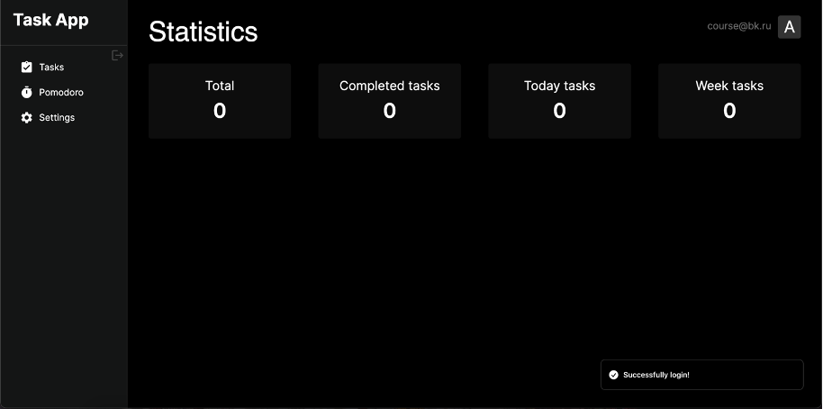
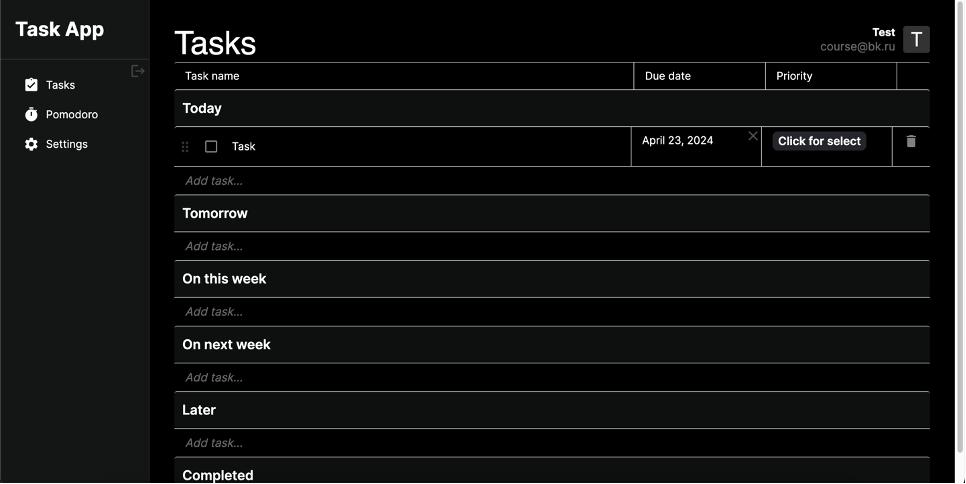

# Task app for coursework

## How to run

* Clone this project
* Install dependencies
```bash
npm install
```
* Start the server on 'localhost:3000'
* Start the client
```bash
npm run dev
```

## STACK

* Next.js
* React
* TypeScript

## Screenshots app
|                      Screenshots                       |
|:------------------------------------------------------:|
|   | 
|  |
